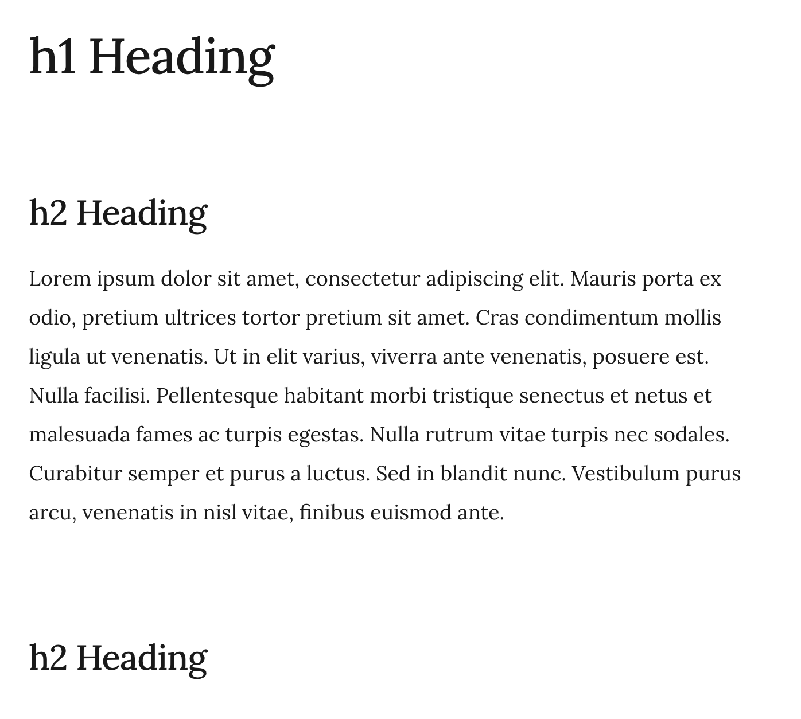
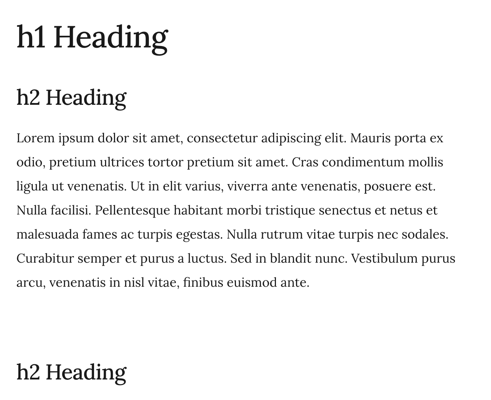

# obsidian-contextual-typography

This plugin adds a `data-tag-name` attribute to all top-level preview `div`s, allowing contextual typography. Note: this plugin does not add any styles, but enables contextual styling.

This is specifically inspired by http://matejlatin.github.io/Gutenberg/

## Sample

```
.markdown-preview-view div[data-tag-name="h1"] + div > h2 {
  margin-top: 1.8888888889rem;
}
```

**Before:**




**After:**

